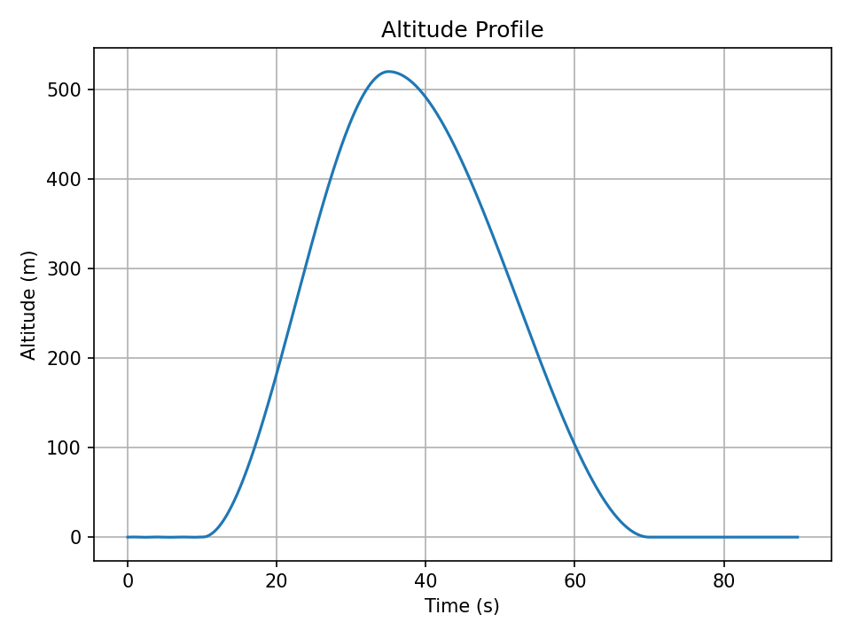
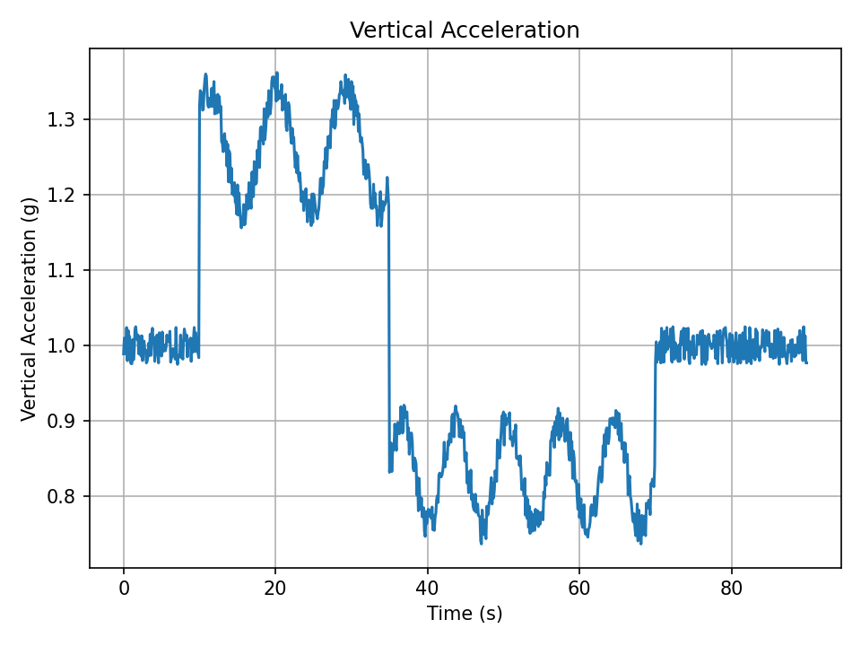
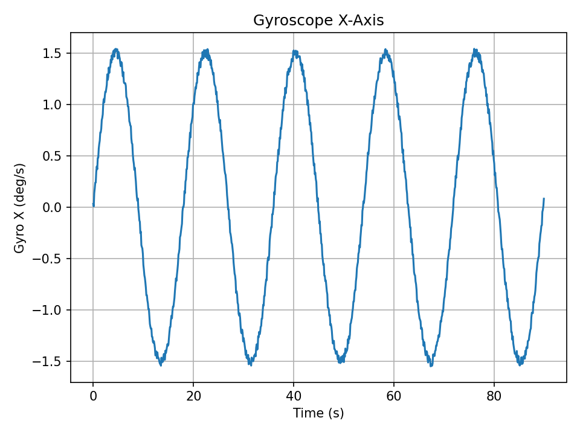
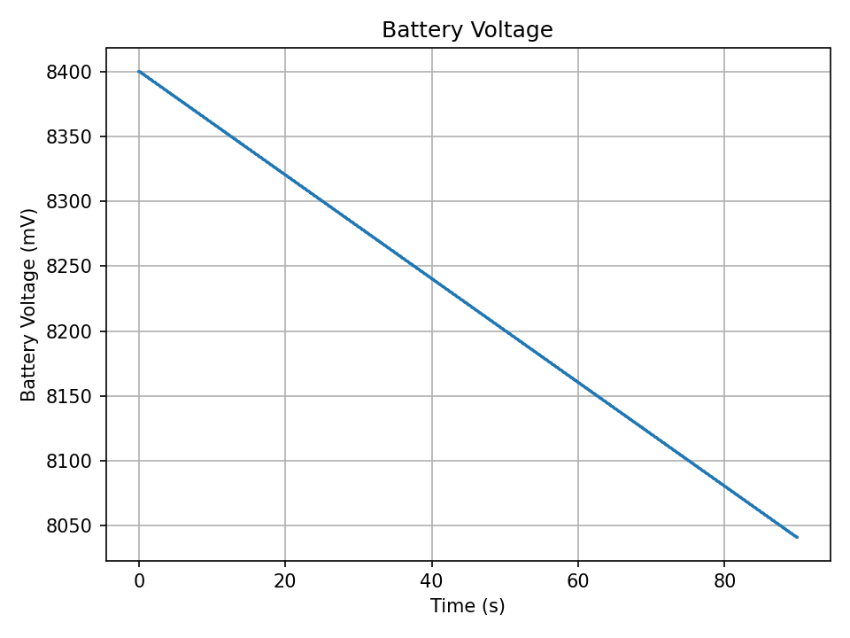
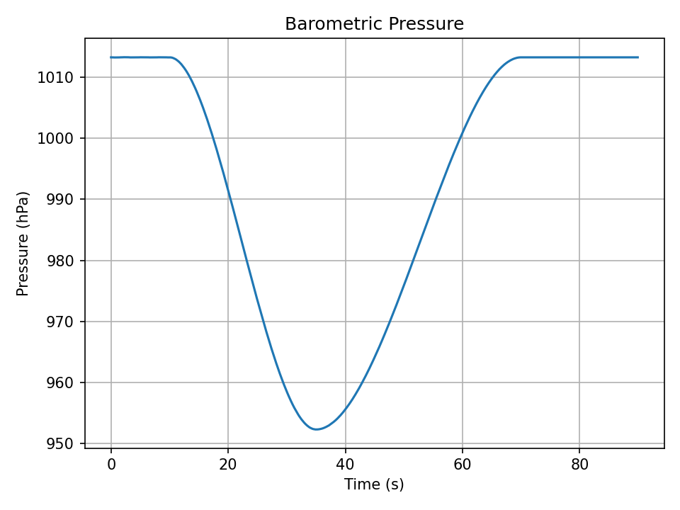

# Embedded Flight Computer & Telemetry Logger

This project is a professional embedded-systems portfolio project focused on flight-style telemetry, validation, and hardware/software integration.

The project begins with a software telemetry simulator, then expands into STM32 firmware, sensor integration, and hardware-in-the-loop testing.

## Part 1: Telemetry Simulator

Part 1 creates a complete telemetry pipeline in Python.

It can:

- Generate simulated flight telemetry
- Write CSV flight logs
- Add CRC-16 checksums
- Validate packet integrity
- Check sample timing
- Detect corrupted data
- Generate engineering plots
- Run automated tests

## Why This Project Matters

Embedded systems are not just about writing firmware. A strong engineering system also needs:

- Clear data formats
- Repeatable testing
- Error checking
- Validation tools
- Logs
- Plots
- Documentation

This project builds that foundation before adding physical STM32 hardware.

## Project Structure

```text
embedded_flight_computer_v1
├── tools
│   ├── telemetry_schema.py
│   ├── generate_sample_log.py
│   ├── validate_log.py
│   └── plot_log.py
├── tests
│   └── run_tests.py
├── sample_data
│   └── flight_log_sample.csv
├── reports
│   ├── altitude_profile.png
│   ├── acceleration_z.png
│   ├── gyro_x.png
│   ├── battery_voltage.png
│   └── pressure.png
├── docs
│   └── part1_design.md
├── README.md
├── requirements.txt
└── .gitignore
```

## Telemetry Fields

Each telemetry record contains:

- Sequence number
- Timestamp
- Flight state
- Acceleration values
- Gyroscope values
- Barometric pressure
- Estimated altitude
- Battery voltage
- GPS fix status
- Latitude and longitude
- CRC-16 checksum

## Flight States

The simulator models four basic flight states:

1. `PRELAUNCH`
2. `ASCENT`
3. `DESCENT`
4. `LANDED`

## Setup

Create and activate a Python virtual environment:

```bash
python3 -m venv .venv
source .venv/bin/activate
```

Install dependencies:

```bash
python -m pip install --upgrade pip
pip install -r requirements.txt
```

## Generate a Sample Flight Log

```bash
python tools/generate_sample_log.py --out sample_data/flight_log_sample.csv --duration 90 --rate-hz 10
```

## Validate the Log

```bash
python tools/validate_log.py sample_data/flight_log_sample.csv
```

Expected result:

```text
Validation passed: CRC, sequence timing, and ranges look good.
```

## Generate Plots

```bash
python tools/plot_log.py sample_data/flight_log_sample.csv --out reports
```

## Run Tests

```bash
python tests/run_tests.py
```

Expected result:

```text
All tests passed.
```

## Results

### Altitude Profile



### Vertical Acceleration



### Gyroscope X-Axis



### Battery Voltage



### Barometric Pressure



## Validation Checks

The validator checks:

- Correct CSV header
- CRC checksum integrity
- Sequence continuity
- Timing consistency
- Battery range
- Altitude range
- GPS fix value

## Future Parts

Planned next phases:

1. STM32 firmware bring-up
2. UART telemetry output
3. Flight state machine in embedded C
4. CRC-protected embedded packets
5. Python serial logger
6. IMU, barometer, and GPS integration
7. Hardware-in-the-loop test bench
8. Linux/C++ telemetry analyzer

## Resume Summary

**Embedded Flight Computer & Telemetry Logger**

- Designed a flight-style telemetry pipeline with simulated sensor data, CRC-protected packets, validation tools, and engineering plots.
- Built Python tools to generate, parse, validate, and visualize telemetry logs at 10 Hz.
- Created automated tests to verify CRC integrity, timing consistency, CSV parsing, and corrupted packet detection.
